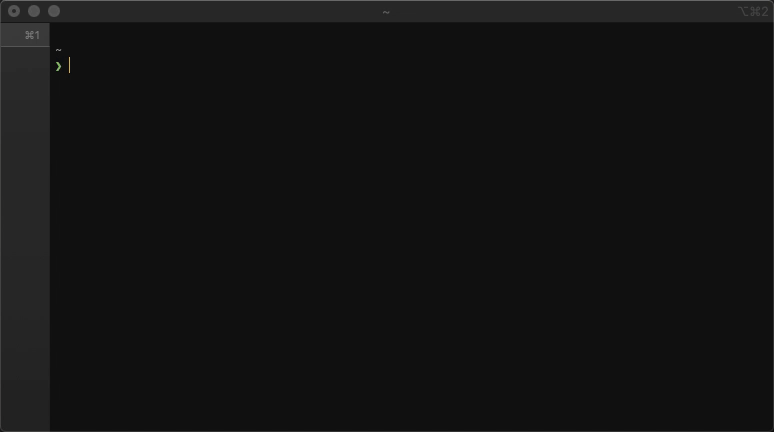

# How to connect to services

!!!note
    While service challenges are often connected to with netcat or PuTTY, solving them will sometimes require using a scripting language like Python. CTF players often use Python alongside [pwntools](https://github.com/Gallopsled/pwntools/).

    You can run [pwntools](http://docs.pwntools.com/en/stable/install.html) right in your browser by using [repl.it](https://repl.it/).

## Using netcat

`netcat` is a networking utility found on macOS and linux operating systems and allows for easy connections to CTF challenges. Service challenges will commonly give you an address and a port to connect to. The syntax for connecting to a service challenge with netcat is `nc <ip> <port>`.

## Using ConEmu

Windows users can connect to service challenges using ConEmu, which can be downloaded [here](https://conemu.github.io/). Connecting to service challenges with ConEmu is done by running `nc <ip> <port>`.